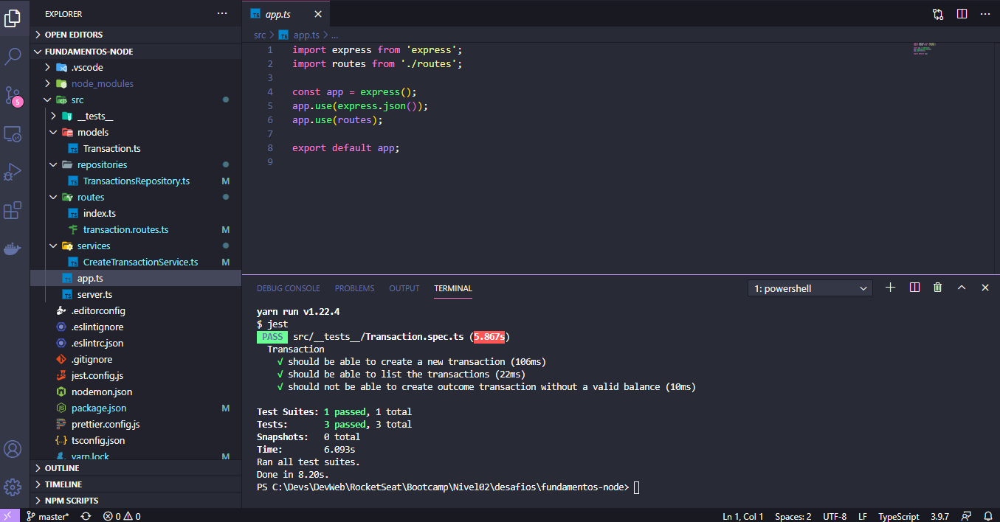

<h3 align="center">
  Desafio 05: Fundamentos do Node.js
</h3>

  <a href="#rocket-o-desafio">O desafio</a>&nbsp;&nbsp;&nbsp;|&nbsp;&nbsp;&nbsp;
  <a href="#hammer-testes">Testes</a>&nbsp;&nbsp;&nbsp;|&nbsp;&nbsp;&nbsp;
  <a href="#snowflake-template">Template</a>&nbsp;&nbsp;&nbsp;|&nbsp;&nbsp;&nbsp;
  <a href="#gear-tecnologias-e-ferramentas">Tecnologias e ferramentas</a>&nbsp;&nbsp;&nbsp;|&nbsp;&nbsp;&nbsp;
  <a href="#memo-licença">Licença</a>

## :rocket: O desafio

Neste desafio foram testados nossos conhecimentos dos fundamentos de NodeJs criando uma aplicação que armazenar transações financeiras de entrada e saída, que deve permitir o cadastro e a listagem dessas transações utilizando o conceito de models, repositories e services.

## :hammer: Testes

Aqui esta uma print dos testes realizados com sucesso.

## :snowflake: Template

Foi utilizado o template do disponibilizado pela RocketSeat, onde criamos uma imagem em nosso próprio repositório e clonado em nosso ambiênte de desenvolvimento.

## :gear: Tecnologias e ferramentas

Foram utilizadas as tecnologias e ferramentas:
* [NodeJs](https://nodejs.org/)
* [Express](https://expressjs.com/)
* [Typescript](https://www.typescriptlang.org/)
* [jest](https://www.npmjs.com/package/jest)

## :memo: Licença

Esse projeto está sob a licença MIT. Veja o arquivo [LICENSE](LICENSE.md) para mais detalhes.

